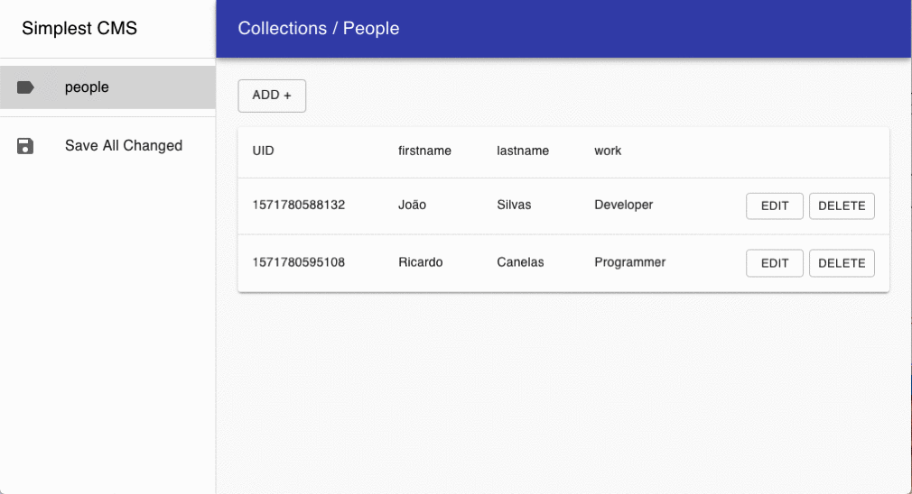

> Note that Simplest-CMS is currently running in Preview. The version available has severe limitations that make it unsuitable for production workloads, including missing features, limited performance and stability issues. We will address all these limitations before issuing a stable release later this year.

# Simplest CMS

It's a Content Management System for SPA (single-page application) websites.

- No database
- Simple authentication
- You create your own structure/collections
- License MIT

You will need to make sure your server meets the following requirements:

- PHP >= 5.4.0
- JSON PHP Extension



## 🔹 Get Started

### Install

```
npx github:ricardocanelas/simplest-cms <your-directory>
```

or copy [these files](https://github.com/ricardocanelas/simplest-cms/tree/master/dist) from the `/dist` directory.

### Config

After install/copy, you need to edit the file "**config.php**".

### To Access

By standard the file is *data.json*

---

## 🔹 API

⚠️ *Working...*

### Fields

**Types**

- [x] text
- [x] textarea
- [x] select
- [x] checkbox
- [ ] radio
- [ ] number
- [ ] email
- [ ] range
- [ ] search
- [ ] time
- [x] datetime
- [x] date
- [ ] country
- [ ] editorhtml
- [ ] editormarkdown
- [ ] url
- [ ] image
- [ ] timestamp
- [ ] color
- [ ] one
- [ ] many
- [ ] slug

**Options**

- [ ] unique
- [x] required
- [x] not-required
- [x] default
- [x] label
- [x] description

### Schema

**No Collection**

If don't want the values should be a collection, add '@' before the name. Example:

*(in config.php)*

```php
// ...

"schema" => [
  "@config" => [
    "title" => "text default(Inc Company)",
    "email" => "text default(myemail@domain.com)",
  ],
]
```

then will be *(in data.json)*

```
{
  "data": {
    ...
    "config": {
      "title": "Inc Company",
      "email": "myemail@domain.com"
    }
  }
}
```

---

## 🔹 Example

In config.php

```php
// ...

'schema' => [
  'people' => [
    'firstname' => 'text required',
    'lastname' => 'text',
    'bio' => 'textarea',
    'civil_status' => 'select(married, single, divorced, widowed)',
    'customer' => 'checkbox default(1)'
  ],
  '@config' => [
    'title' => 'text default(Inc Company)',
    'email' => 'text default(myemail@domain.com)',
  ],
]
```

In JavaScript:

```js
const getData = fetch(`./data.json`)
 .then(res => res.json())

getData().then(data) => {
  console.log('All data:', data)
}
```